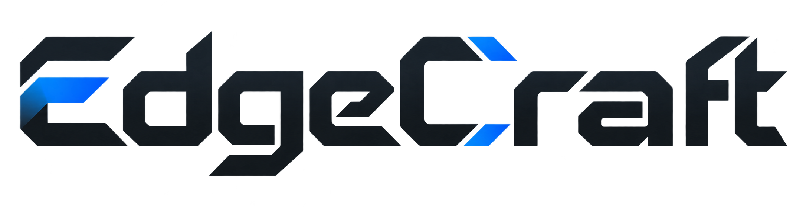

<p align="center">
  <picture>
    <source media="(prefers-color-scheme: dark)" srcset="assets/edgecraft-logo-dark.png">
    
  </picture>
</p>

<p align="center"><strong>Automated Model Crafting for Edge IoT</strong></p>

EdgeCraft turns a task description, a dataset, and device constraints into a
trained model verified on the target edge device. Its three core components are
a constraint-aware synthesis tree, a multi-fidelity verifier, and shared
services for scheduling and verified failure reuse. The implementation follows
the paper's separation between LLM proposals and measured acceptance decisions.

Genglin Wang, Kaiwei Liu, Liekang Zeng, Wangsong Yin, Shangcheng Jin,
Guoliang Xing, and Zhenyu Yan.

[Paper](https://arxiv.org/abs/2609.35167) ·
[Release v0.1.0](https://github.com/genglinWang/edgecraft/releases/tag/v0.1.0) ·
[Design and code](PAPER_CODE_MAP.md) · [Devices](docs/devices.md) ·
[Datasets](docs/datasets.md) · [Security](SECURITY.md)

## Tutorial

### 1. Install the controller

Use a Linux x86_64 training host with Python 3.12 and an NVIDIA GPU. The edge
device runs inference; it does not need the controller's Python environment.
The pinned controller stack uses CUDA 12.8 PyTorch wheels and needs a compatible
NVIDIA driver.

```bash
git clone https://github.com/genglinWang/edgecraft.git
cd edgecraft
python3.12 -m venv .venv
source .venv/bin/activate
python -m pip install -c requirements-controller.txt -e .
cp .env.example .env
```

Edit `.env` with your LLM provider, model, storage paths, and SSH connection.
Synthesis uses your provider credentials and incurs that provider's API charges.
Tests and data inspection use no LLM calls. Select training GPUs with
`EDGECRAFT_GPU_IDS`; the scheduler coordinates requests within this service,
not workloads started by other applications.

### 2. Prepare an edge device

Follow [device setup](docs/devices.md) for Orin, Xavier NX, TX2, Pi 5, or desktop
CPU. Jetsons and desktop CPU use Docker; Pi 5 uses native Python environments.
The device must be reachable from the controller. Supply its address as
`user@host` and the private key explicitly; first verify the SSH host fingerprint.

```bash
set -a
. ./.env
set +a
ssh -i "$SSH_KEY_PATH" -o IdentitiesOnly=yes "$DEVICE_HOST" true
mkdir -p "$OUTPUT_DIR"
```

The bundled runner is sent over SSH when a job starts. The normal flow uses a
user-owned device directory and requires no systemd installation.

### 3. Prepare your dataset

The [dataset guide](docs/datasets.md) lists all 50 public benchmark datasets,
their sources, and expected formats. Supply a directory containing inputs and
labels; keep official train/validation/test partitions when provided. For
example, prepare TweetEval sentiment using the helper in that guide, then inspect
the data locally:

```bash
edgecraft data list
edgecraft data inspect "$DATA_ROOT/tweet_eval"
```

The same interface accepts your own dataset. During synthesis, the agent
inspects its schema and writes the loader for the task.

### 4. Run synthesis and read the result

For a containerized target:

```bash
edgecraft synth "Classify the supplied data; maximize accuracy with p95 latency <= 100 ms" \
  --profile paper --iterations 24 \
  --dataset "$DATA_ROOT/my_dataset" \
  --ip "$DEVICE_HOST" --ssh-key "$SSH_KEY_PATH" \
  --docker-image "$EDGE_DOCKER_IMAGE"
```

For Pi 5, omit `--docker-image` and configure its native Python paths as shown in
[device setup](docs/devices.md). The `paper` profile enables tree search, P0/P1/P2
verification, shared scheduling, failure reuse, and resource telemetry.

The CLI reports the selected artifact, measured quality and constraints, and
run ID. Per-candidate code, models, measurements, and `trial_bank.json` are
stored under `$EDGECRAFT_ROOT/workspaces/`. To resume, use the same inputs and
`--run-id`. A result marked `completed_infeasible` includes a verified artifact
and its remaining SLO gaps. See [run behavior](REPRODUCIBILITY.md) for calibration,
rule learning, and resource accounting.

## Development checks

These checks use small synthetic examples and need no API key or device:

```bash
python -m pip install -r requirements-test.txt
EDGECRAFT_DISABLE_LLM=1 python -m pytest -q
python scripts/release_smoke.py
python examples/offline_mechanisms.py
```

The implementation is organized under `edgecraft/agent/`,
`edgecraft/knowledge/`, `edgecraft/scheduler/`, and `edgecraft/tools/`.
`devices/` contains runtime setup assets. The source distribution starts with
empty rule, calibration, and search-memory stores; datasets and model weights
are obtained separately.

## Citation and license

```bibtex
@misc{wang2026edgecraft,
  title  = {EdgeCraft: Automated Model Crafting for Edge IoT},
  author = {Genglin Wang and Kaiwei Liu and Liekang Zeng and Wangsong Yin
            and Shangcheng Jin and Guoliang Xing and Zhenyu Yan},
  year   = {2026},
  eprint = {2609.35167},
  archivePrefix = {arXiv},
  primaryClass = {cs.LG},
  url    = {https://arxiv.org/abs/2609.35167}
}
```

Copyright (c) 2026 EdgeCraft Authors. EdgeCraft is licensed under the
[GNU Affero General Public License v3.0](LICENSE) (`AGPL-3.0-only`).
Third-party libraries, datasets, and model weights retain their own licenses;
see [third-party notices](THIRD_PARTY_NOTICES.md).

See [CITATION.cff](CITATION.cff) for citation metadata and
[CONTRIBUTING.md](CONTRIBUTING.md) for contribution guidelines.
